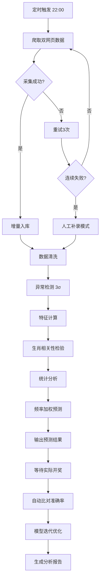

# 农历生肖时序数据自动化统计分析预测平台 - 产品需求文档

**版本**：V2.0
**日期**：2026-06-12
**状态**：开发中

---

## 1. 产品概述

本项目旨在构建一套定时自动化的离散时序数据统计分析平台，以农历生肖年份为辅助分析维度，依托指定网页公开历史数据，实现数据自动采集、治理、统计分析、预测推演、模型迭代优化及结果可视化输出的全流程闭环管理。

### 目标用户
- 数据分析师：进行数据研究、规律挖掘
- 运营人员：监控数据采集、处理流程
- 管理员：系统配置、权限管理、模型优化

### 核心价值
- 全自动化数据采集与清洗，保障数据完整性
- 基于基础统计学的可解释性预测模型
- 持续迭代优化，提升预测准确率
- 完整审计追溯，满足合规要求

---

## 2. 核心功能模块

### 2.1 用户角色

| 角色 | 注册方式 | 核心权限 |
|------|---------|---------|
| 管理员 | 系统初始化 | 全部功能、用户管理、权限配置、系统设置 |
| 分析师 | 管理员创建 | 数据查看、分析报告、预测操作 |
| 只读用户 | 管理员创建 | 数据查看、报告查看 |

### 2.2 功能模块列表

1. **数据采集模块**：定时爬虫、人工补录、增量更新、异常告警
2. **数据治理模块**：去重、异常处理、缺失补全、格式标准化、特征计算
3. **统计分析模块**：频次统计、分布分析、同期对比、相关性检验
4. **预测模块**：频率加权预测、生肖维度加权、置信度计算
5. **模型优化模块**：自学习修正、错误模式分析、版本管理
6. **任务调度模块**：定时任务配置、日志管理、告警通知
7. **结果展示模块**：数据表格、可视化图表、报告导出
8. **系统管理模块**：用户权限、数据备份、审计日志

### 2.3 页面详情

| 页面名称 | 模块名称 | 功能描述 |
|---------|---------|---------|
| 登录页 | 认证模块 | 用户登录、双因素认证（可选） |
| 仪表盘 | 概览展示 | 关键指标卡片、近期预测准确率趋势、数据采集状态 |
| 数据采集 | 采集配置 | Cron表达式配置、手动触发、历史采集记录 |
| 数据管理 | 数据列表 | 原始数据表格、筛选搜索、详情查看 |
| 数据治理 | 治理配置 | 清洗规则配置、异常记录处理、缺失值处理 |
| 统计分析 | 分析面板 | 频次柱状图、分布直方图、同期对比、多源交叉 |
| 生肖检验 | 检验工具 | 卡方检验配置、执行、结果展示 |
| 预测管理 | 预测列表 | 历史预测结果、与实际数据比对 |
| 模型管理 | 模型版本 | 版本列表、参数配置、回滚操作 |
| 报告中心 | 报告列表 | 周报/月报生成、导出、查看 |
| 人工补录 | 文件上传 | CSV/Excel上传、格式校验、入库确认 |
| 系统设置 | 配置中心 | 告警配置、备份策略、系统参数 |
| 用户管理 | 权限管理 | 用户CRUD、角色配置 |

---

## 3. 核心流程

### 3.1 数据采集流程

```
定时触发(Cron 22:00) → 爬取双网页数据 → 期号判重 → 增量入库
    ↓
异常情况 → 失败重试(3次,指数退避) → 连续3天失败 → 切换人工补录模式
```

### 3.2 数据分析预测主流程

```
数据入库 → 清洗治理 → 特征计算 → 生肖相关性检验(卡方检验 α=0.05)
    ↓
统计分析(频次/分布/同期) → 滑动窗口频率加权预测 → 置信度计算
    ↓
输出预测结果 → 等待实际数据 → 自动比对 → 准确率核算 → 模型迭代
```

### 3.3 流程图



---

## 4. 用户界面设计

### 4.1 设计风格

**设计理念**：数据驱动、专业严谨、清晰高效

**色彩方案**：
- 主色：#1a365d（深海蓝）- 传递专业可靠
- 次色：#2d3748（深灰）- 内容区域背景
- 强调色：#ed8936（琥珀橙）- 关键数据高亮
- 成功色：#38a169（翠绿）- 准确预测
- 警告色：#e53e3e（警示红）- 异常数据
- 背景色：#f7fafc（浅灰白）- 页面背景

**字体选择**：
- 标题：Noto Serif SC（衬线体，庄重感）
- 正文：Noto Sans SC（无衬线，易读性）
- 数据：JetBrains Mono（等宽，数据对齐）

**按钮样式**：圆角矩形 8px，圆润但不失专业感

**布局风格**：
- 左侧固定导航栏，宽度 240px
- 顶部工具栏，包含搜索、通知、个人信息
- 主内容区采用卡片式布局
- 数据表格采用斑马纹设计

**图标风格**：Lucide Icons，线性风格，2px描边

### 4.2 页面设计概览

| 页面名称 | 主要UI元素 |
|---------|-----------|
| 仪表盘 | 指标卡片网格、数据趋势折线图、快捷操作按钮 |
| 数据采集 | 状态指示灯、任务日志列表、时间轴配置 |
| 数据管理 | 可编辑表格、批量操作栏、详情抽屉 |
| 统计分析 | ECharts图表面板、筛选条件栏、导出按钮 |
| 生肖检验 | 参数配置表单、检验结果表格、P值可视化 |
| 预测管理 | 预测结果卡片、比对方框、置信度进度条 |
| 模型管理 | 版本时间线、参数对比表、回滚确认弹窗 |
| 报告中心 | 报告卡片列表、预览面板、导出选项 |
| 系统设置 | 分组配置面板、表单验证、开关控件 |

### 4.3 响应式策略

- 桌面优先设计（1440px+ 最佳）
- 平板适配（768px-1439px）：导航收起为抽屉
- 移动端（<768px）：底部Tab导航，简化表格

---

## 5. 数据规范

### 5.1 核心数据字段

| 字段名 | 类型 | 说明 |
|-------|------|------|
| period_id | INTEGER | 期号，自然编号 |
| gregorian_date | DATE | 公历日期 yyyy-MM-dd |
| lunar_date | VARCHAR(50) | 农历日期描述 |
| zodiac_year | VARCHAR(10) | 生肖年份（鼠/牛/虎/...） |
| main_numbers | VARCHAR(100) | 主号码序列 |
| special_number | INTEGER | 特码 |
| source_url | VARCHAR(500) | 数据来源URL |
| collected_at | TIMESTAMP | 采集时间 |
| version | VARCHAR(50) | 数据版本号 |

### 5.2 预测结果字段

| 字段名 | 类型 | 说明 |
|-------|------|------|
| predict_id | UUID | 预测记录ID |
| period_id | INTEGER | 预测期号 |
| predicted_numbers | VARCHAR(100) | 预测号码 |
| confidence | DECIMAL(5,4) | 置信度 0-1 |
| zodiac_weighted | BOOLEAN | 是否使用生肖加权 |
| lift_value | DECIMAL(5,4) | 提升度 |
| p_value | DECIMAL(5,6) | 统计显著性P值 |
| created_at | TIMESTAMP | 预测时间 |

---

## 6. 验收标准

### 6.1 功能验收

- [ ] 定时采集任务可正常配置和执行
- [ ] 增量更新正确判重，不重复入库
- [ ] 数据清洗异常检测准确率≥99%
- [ ] 卡方检验正确实现，p值计算准确
- [ ] 预测结果包含置信度和提升度
- [ ] 准确率自动核算功能正常
- [ ] 模型版本可追溯、可回滚
- [ ] 报告可按模板生成并导出

### 6.2 性能要求

- 页面首屏加载 < 2秒
- 数据查询响应 < 1秒（10万条数据内）
- 预测计算 < 5秒

### 6.3 安全要求

- 敏感数据加密存储
- 操作审计日志完整
- RBAC权限控制有效

---

**文档版本**：
- V1.0 (2026-06-12): 初始版本
