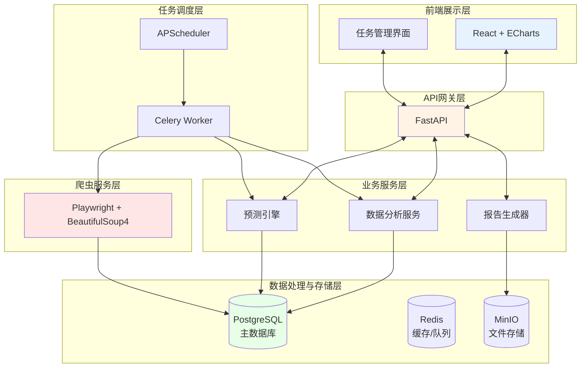
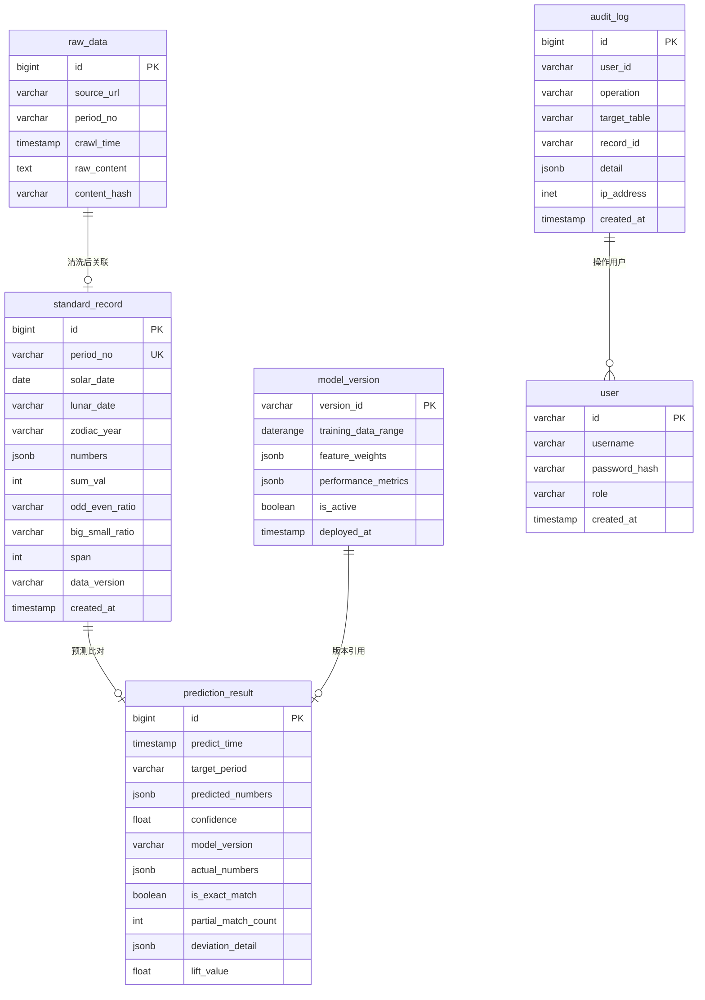

# 农历生肖时序数据自动化统计分析预测平台 - 技术架构文档

**版本**：V1.0
**日期**：2026-06-12
**状态**：待评审

---

## 1. 系统架构设计

### 1.1 整体架构图



### 1.2 技术栈

| 层级 | 技术选型 | 说明 |
|-----|---------|-----|
| 前端 | React 18 + TypeScript | 函数式组件，Hooks |
| UI框架 | TailwindCSS | 原子化CSS |
| 可视化 | ECharts 5 | 图表渲染 |
| 状态管理 | Zustand | 轻量状态管理 |
| 后端框架 | FastAPI | 高性能异步API |
| 任务调度 | APScheduler + Celery | 定时任务与异步队列 |
| 数据库 | PostgreSQL 14 | 主数据存储 |
| 缓存/消息队列 | Redis 7 | 缓存与Celery broker |
| 文件存储 | MinIO | 对象存储（备份/报告） |
| 爬虫 | Playwright + BeautifulSoup4 | 网页数据采集 |
| 反向代理 | Nginx + Gunicorn | 生产环境部署 |

---

## 2. 数据库表结构设计

### 2.1 ER图



### 2.2 数据定义语言（DDL）

```sql
-- 原始数据快照表
CREATE TABLE raw_data (
    id BIGSERIAL PRIMARY KEY,
    source_url VARCHAR(500) NOT NULL,
    period_no VARCHAR(50) NOT NULL,
    crawl_time TIMESTAMP DEFAULT CURRENT_TIMESTAMP,
    raw_content TEXT,
    content_hash VARCHAR(64) NOT NULL,
    UNIQUE(source_url, period_no, content_hash)
);

-- 标准开奖记录表
CREATE TABLE standard_record (
    id BIGSERIAL PRIMARY KEY,
    period_no VARCHAR(50) UNIQUE NOT NULL,
    solar_date DATE NOT NULL,
    lunar_date VARCHAR(50),
    zodiac_year VARCHAR(10),
    numbers JSONB NOT NULL,
    sum_val INTEGER,
    odd_even_ratio VARCHAR(20),
    big_small_ratio VARCHAR(20),
    span INTEGER,
    data_version VARCHAR(50),
    created_at TIMESTAMP DEFAULT CURRENT_TIMESTAMP
);

-- 预测结果与比对表
CREATE TABLE prediction_result (
    id BIGSERIAL PRIMARY KEY,
    predict_time TIMESTAMP DEFAULT CURRENT_TIMESTAMP,
    target_period VARCHAR(50) NOT NULL,
    predicted_numbers JSONB NOT NULL,
    confidence FLOAT,
    model_version VARCHAR(50),
    actual_numbers JSONB,
    is_exact_match BOOLEAN,
    partial_match_count INTEGER,
    deviation_detail JSONB,
    lift_value FLOAT
);

-- 模型版本控制表
CREATE TABLE model_version (
    version_id VARCHAR(50) PRIMARY KEY,
    training_data_range DATERANGE,
    feature_weights JSONB,
    performance_metrics JSONB,
    is_active BOOLEAN DEFAULT FALSE,
    deployed_at TIMESTAMP DEFAULT CURRENT_TIMESTAMP
);

-- 审计日志表
CREATE TABLE audit_log (
    id BIGSERIAL PRIMARY KEY,
    user_id VARCHAR(50),
    operation VARCHAR(20) NOT NULL,
    target_table VARCHAR(50),
    record_id VARCHAR(50),
    detail JSONB,
    ip_address INET,
    created_at TIMESTAMP DEFAULT CURRENT_TIMESTAMP
);

-- 用户表
CREATE TABLE users (
    id VARCHAR(50) PRIMARY KEY,
    username VARCHAR(100) UNIQUE NOT NULL,
    password_hash VARCHAR(255) NOT NULL,
    role VARCHAR(20) NOT NULL DEFAULT 'readonly',
    created_at TIMESTAMP DEFAULT CURRENT_TIMESTAMP
);

-- 索引
CREATE INDEX idx_raw_data_period ON raw_data(period_no);
CREATE INDEX idx_raw_data_crawl_time ON raw_data(crawl_time);
CREATE INDEX idx_standard_record_solar ON standard_record(solar_date);
CREATE INDEX idx_standard_record_zodiac ON standard_record(zodiac_year);
CREATE INDEX idx_prediction_target ON prediction_result(target_period);
CREATE INDEX idx_audit_log_time ON audit_log(created_at);
```

---

## 3. 核心统计计算公式

### 3.1 号码频率计算

```
号码i出现频率：fi = ni / N
- ni：号码i出现次数
- N：总期数
```

### 3.2 条件频率计算

```
生肖z条件下号码i频率：fi|z = ni,z / Nz
- ni,z：生肖z下号码i出现次数
- Nz：生肖z下的总期数
```

### 3.3 预测评分（加权）

```
Si = w1·fi + w2·fi|z + w3·recency_factor

初始权重配置：
- w1 = 0.5 (总体频率)
- w2 = 0.3 (生肖条件频率)
- w3 = 0.2 (近期衰减因子)

注：若生肖相关性检验不通过，则 w2 = 0
```

### 3.4 准确率计算

```
全中准确率：Acc_exact = N_exact_match / N_predict

部分准确率：Acc_partial = N_partial / N_predict

提升度：Lift = (Acc - P_random) / P_random
- P_random = 1 / C(N,k) （随机命中概率）
```

### 3.5 置信区间（Wilson区间）

```
        p̂ + z²/(2n) ± z√[p̂(1-p̂)/n + z²/(4n²)]
p = ─────────────────────────────────────────────
                   1 + z²/n

其中：
- p̂：观测准确率
- n：样本数
- z = 1.96 (95%置信度)
```

---

## 4. API路由定义

### 4.1 路由总览

| 路由 | 方法 | 用途 |
|-----|------|-----|
| /api/auth/login | POST | 用户登录 |
| /api/auth/logout | POST | 用户登出 |
| /api/dashboard/stats | GET | 仪表盘统计数据 |
| /api/data/raw | GET | 原始数据列表 |
| /api/data/standard | GET | 标准数据列表 |
| /api/data/standard/{id} | GET | 标准数据详情 |
| /api/crawl/trigger | POST | 手动触发采集 |
| /api/crawl/history | GET | 采集历史记录 |
| /api/analysis/frequency | GET | 频次统计 |
| /api/analysis/distribution | GET | 分布分析 |
| /api/analysis/zodiac-test | POST | 执行生肖相关性检验 |
| /api/prediction/latest | GET | 最新预测结果 |
| /api/prediction/history | GET | 预测历史 |
| /api/prediction/generate | POST | 手动生成预测 |
| /api/model/versions | GET | 模型版本列表 |
| /api/model/rollback | POST | 回滚模型版本 |
| /api/report/generate | POST | 生成报告 |
| /api/report/list | GET | 报告列表 |
| /api/settings/config | GET/PUT | 系统配置 |
| /api/backup/create | POST | 创建备份 |
| /api/backup/restore | POST | 恢复备份 |

### 4.2 核心API Schema

```typescript
// 标准数据记录
interface StandardRecord {
  id: number;
  period_no: string;
  solar_date: string;
  lunar_date: string;
  zodiac_year: string;
  numbers: { main: number[]; special: number };
  sum_val: number;
  odd_even_ratio: string;
  big_small_ratio: string;
  span: number;
}

// 预测结果
interface PredictionResult {
  id: number;
  predict_time: string;
  target_period: string;
  predicted_numbers: number[];
  confidence: number;
  model_version: string;
  actual_numbers?: { main: number[]; special: number };
  is_exact_match?: boolean;
  partial_match_count?: number;
  lift_value?: number;
}

// 统计概览
interface DashboardStats {
  total_records: number;
  recent_accuracy: number;
  lift_value: number;
  next_predict_time: string;
  crawl_status: 'idle' | 'running' | 'failed';
}
```

---

## 5. 定时任务配置

### 5.1 任务列表

| 任务名称 | 触发时间 | 执行逻辑 |
|---------|---------|---------|
| crawl_daily | 22:00 | 执行双网页爬虫，写入raw_data |
| clean_new_data | 23:00 | 清洗新增raw_data，写入standard_record |
| feature_update | 23:30 | 更新统计特征表、重新计算频率表 |
| prediction_task | 23:45 | 载入最新模型权重，生成下一期预测 |
| accuracy_update | 次日开奖后 | 回填实际结果，计算准确率 |
| model_evaluation | 每周一03:00 | 综合近期准确率评估模型，输出评估报告 |

### 5.2 任务调度伪代码

```python
def generate_prediction(latest_n=300, top_k=7):
    # 1. 加载滑动窗口内的历史数据
    history = db.get_recent_records(latest_n)
    
    # 2. 执行生肖相关性检验（每30天重新检验一次）
    if need_re_test():
        zodiac_significant = chi_square_independence(history, 'zodiac_year', 'numbers')
        cache.set('zodiac_significant', zodiac_significant)
    
    # 3. 计算总体频率和条件频率
    overall_freq = calc_freq(history['numbers'])
    if cache.get('zodiac_significant'):
        zodiac_freq = calc_conditional_freq(history, 'zodiac_year')
    else:
        zodiac_freq = None
    
    # 4. 获取最新模型权重
    weights = get_active_model_weights()
    
    # 5. 计算每个候选号码的加权得分
    scores = {}
    for num in all_possible_numbers:
        recency = calc_recency_score(num, history)
        s = weights['w_overall'] * overall_freq.get(num, 0)
        if zodiac_freq:
            s += weights['w_zodiac'] * zodiac_freq.get(target_zodiac, {}).get(num, 0)
        s += weights['w_recency'] * recency
        scores[num] = s
    
    # 6. 按得分降序选Top-K，计算置信度
    selected = sorted(scores, key=scores.get, reverse=True)[:top_k]
    confidence = calc_confidence(selected, history)
    
    # 7. 持久化预测结果
    save_prediction(selected, confidence, model_version)
    return selected, confidence
```

---

## 6. 部署与环境要求

### 6.1 环境要求

| 组件 | 版本要求 | 说明 |
|-----|---------|-----|
| 操作系统 | Ubuntu 20.04+ | LTS版本 |
| Python | 3.10+ | 依赖管理：poetry |
| Node.js | 18+ | 前端构建 |
| PostgreSQL | 14+ | 主数据库 |
| Redis | 7+ | 缓存与消息队列 |
| Nginx | 1.18+ | 反向代理 |
| Docker | 24+ | 容器化（推荐） |

### 6.2 Docker Compose 架构

```yaml
services:
  frontend:
    build: ./frontend
    ports:
      - "3000:3000"
    
  backend:
    build: ./backend
    ports:
      - "8000:8000"
    depends_on:
      - postgres
      - redis
    
  worker:
    build: ./backend
    command: celery -A app.worker worker
    depends_on:
      - postgres
      - redis
    
  postgres:
    image: postgres:14
    volumes:
      - postgres_data:/var/lib/postgresql/data
    
  redis:
    image: redis:7
    volumes:
      - redis_data:/data
    
  minio:
    image: minio/minio
    volumes:
      - minio_data:/data

volumes:
  postgres_data:
  redis_data:
  minio_data:
```

---

## 7. 安全设计

### 7.1 访问控制（RBAC）

| 角色 | 权限 |
|-----|------|
| admin | 全部功能、用户管理、权限配置 |
| analyst | 数据查看、分析、预测、报告 |
| readonly | 仅数据查看 |

### 7.2 数据加密

- 敏感字段：AES-256 加密存储
- 传输通道：HTTPS/TLS 1.3
- 密钥管理：环境变量或密钥管理服务

### 7.3 审计追溯

- 全表变更记录到 audit_log
- 关键操作（删除、回滚）需二次确认
- 日志保留不少于 6 个月

---

**文档版本**：
- V1.0 (2026-06-12): 初始版本，整合用户技术方案
